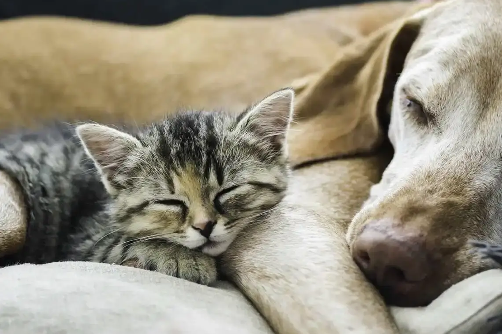
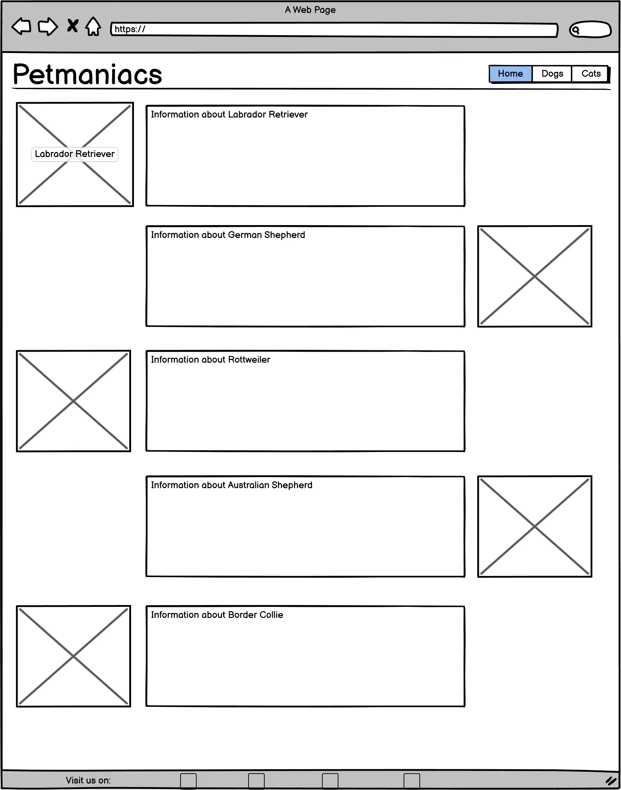
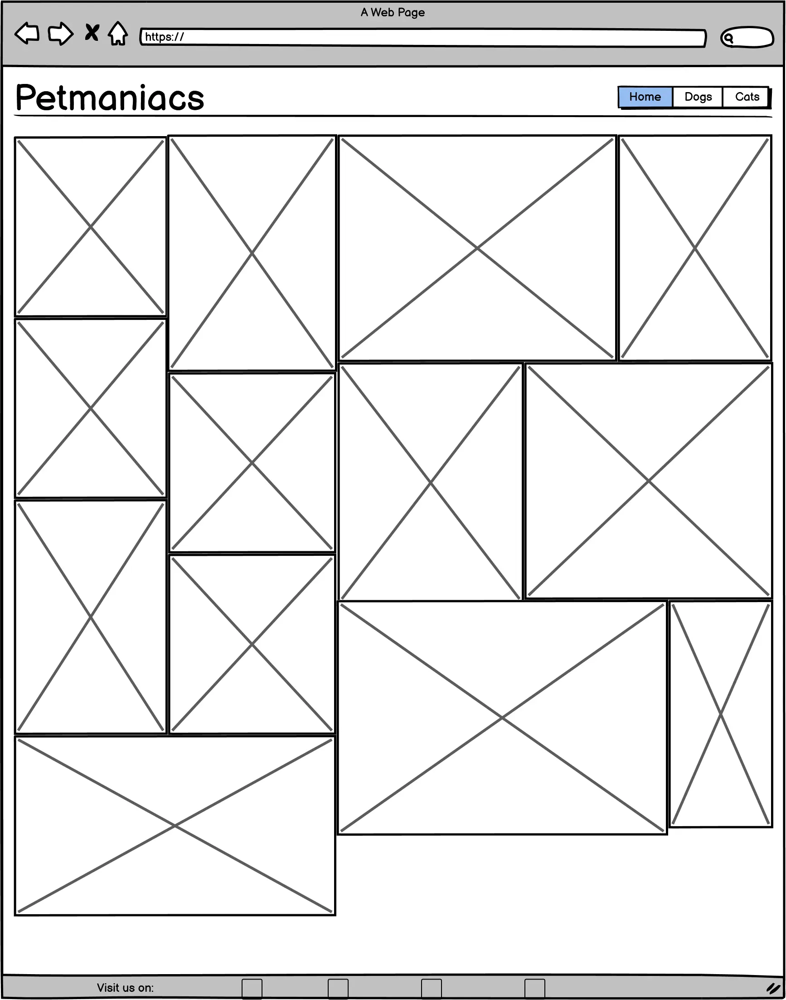
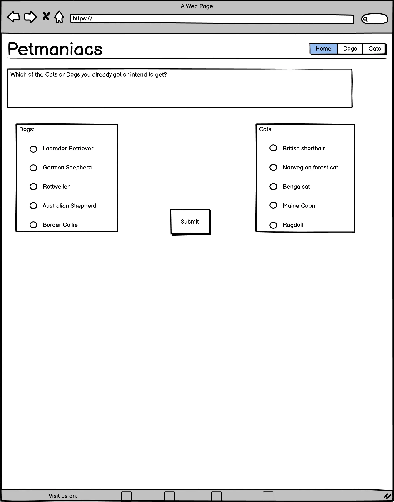

### Petmaniac

This is a Website for information about various breeds of cats and dogs. In case you want to become a dog- or catowner or want just information about various breeds with just one look. 
You will learn about the specifics, the traits and things you need to look out for, for every of the listed breeds. It allows Users to check on all neccesary Information for either preparing to get a pet and want to know what they need to look out for. Users can join  survey, which of the breeds they intend to get or already got. The Website includes an gallery for all the breeds. Click <a href="placeholder">here</a> for the live Website.

## List of Features
<ol>
<li>Permanent navigation menu in header. For Smartphones a dropdown menu</li>
<li>Footer with all relevant social media platforms with there distinctive Icon as _blank link.  </li>
<li>Site wide Favicon</li>
<li>Gallery page, which contains various images of the different breeds. This page is fully responsive and reacts different on various devices.</li>
<li>Dog and Cats pages, which contain all relevant information about the different breeds. These pages are fully responsive aswell.</li>
<li>Imaginary survey for the users where they can choose the cat- and dogbreeds they got or want to get in future.</li>
<li>404 Page for broken links</li>
</ol>

## Wireframes

Mainpage

Dog- and Catpage

Gallerypage

## Sources
<ul>
<li> Information about various Catbreeds <a href="https://www.zooroyal.de/magazin/katzen/die-50-beliebtesten-katzenrassen/" target="_blank" rel="noopener"> Click here</a> </li>
<li>All pictures are owned by myself Marc Steinfort or are creative commons licenses and free to use. </li>
<li><a href="https://www.freepik.com/icon/animal-shelter_3769065" target="_blank" rel="noopener">Favicon by Freepik</a></li>
</ul>

## Technologies used
<ul>
<li>Googlefonts: <a href="https://fonts.google.com/" target="_blank" rel="noopener"> Google fonts </a> </li>
<li>Font awesome: <a href="https://fontawesome.com/" target="_blank" rel="noopener"> Font awesome </a> </li>
<li>Tinypng to compress my Webp images: <a href="https://tinypng.com" target="_blank" rel="noopener"> Tinypng </a> </li>
<li>Cloudconvert to convert my .png and .jpeg files: <a href="https://cloudconvert.com/jpeg-to-webp" target="_blank" rel="noopener"> Cloudconvert </a> </li>
<li>Favicon converter for the Favicon Icon: <a href="https://favicon.io/favicon-converter/" target="_blank" rel="noopener"> Favicon converter </a> </li>
</ul>